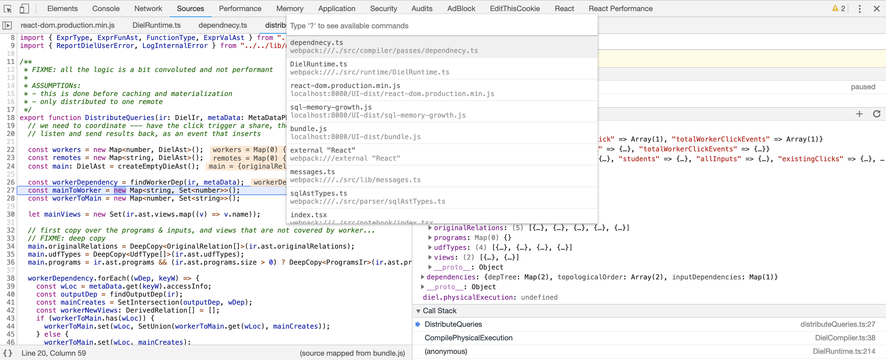
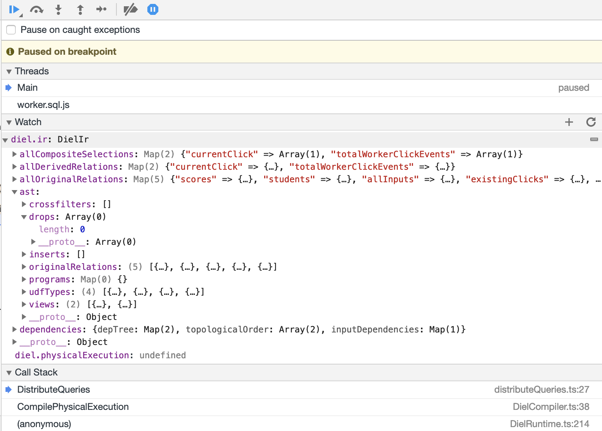

# Debug

## Using the Chrome Debugger

Chrome debugger is one of the best!

You can set break points in the TypeScript code, as well as use Cmd-P to navigate to the files you need (the same way as VS Code)


Also, since DIEL has a global object that contains most of the information you might be interested in inpecting, the `diel.ir`, you can "watch" in Chrome debugger like so:


## Common compiler errors

If you see anything associated with the parser that are missing methods, this might be because the language was updated, in which case you can fix by running `npm run lang`.

We have also seen cases where `npm install` was missing the new installs, just follow the error message and see if the types or methods missing are from a library, and install whatever is required for that library.


## ts-node oddidities

Sometimes the cache is not cleared, we can find where the files are by doing:

```bash
node
require('os')
os.tmpdir()
```

For example, `/var/folde/_h/d_tf4ms16vn5286zx7tr8yd40000gn/T`

Then remove whatever looks like e.g., the following `ts-node-4e5d2e76c9ea473c266612739622ce04347406d7cd18ea771468db51b9f91fe7`

## ANTLR

ANTLR parser's tokenizing process is a bit fickle... The [bash token stream inspector](https://medium.com/@bkiers/debugging-antlr-4-grammars-58df104de5f6) from Bart Kiers which I placed in `\debug` is very helpful, can be ran e.g. (note the `queries` is the entry point of the grammar)

```bash
./antlr4-tester.sh DIEL.g4 "CREATE PROGRAM\nBEGIN\n  INSERT INTO RANDOM2 (A, b, c) VALUES (132)\n END;" queries
```